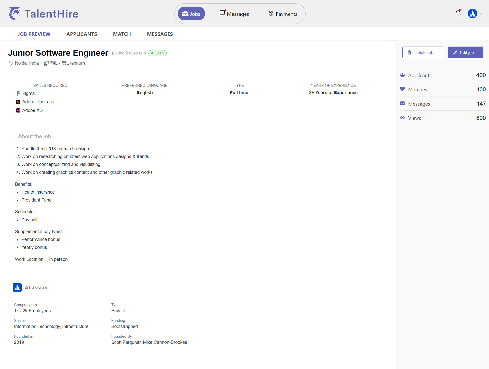

# TalentHire



TalentHire is a modern web application designed to streamline the recruitment process for companies and job seekers. This platform offers a comprehensive set of features to manage job postings, track applicants, and communicate efficiently.

## Table of Contents

- [Features](#features)
- [Technologies](#technologies)
- [Installation](#installation)
- [Usage](#usage)
- [Contributing](#contributing)
- [License](#license)
- [Contact](#contact)

## Features

- **Job Postings**: Create and manage job postings with detailed descriptions, skill requirements, and benefits.
- **Applicant Tracking**: Track the number of applicants, matches, messages, and views for each job posting.
- **Communication**: Seamlessly communicate with potential hires through integrated messaging.
- **Company Profiles**: Detailed company profiles with information on size, type, sector, funding, and founders.
- **Job Preview**: A clear and concise job preview page to attract potential candidates.

## Technologies

- **Frontend**: React.js, CSS
- **Backend**: Node.js

## Installation

1. **Clone the repository**
   ```sh
   git clone https://github.com/agamjotsingh18/TalentHire.git
   cd TalentHire
   ```

2. **Install dependencies**
   ```sh
   npm install
   ```

3. **Change to talenthire directory**

   ```sh
   cd talenthire
   ```

4. **Run the application**
   ```sh
   npm start
   ```

## Usage

1. **Admin Dashboard**: Manage job postings, track applicants, and communicate with candidates.
2. **Job Seekers**: Browse available job listings, apply for jobs, and communicate with potential employers.
3. **Company Profiles**: View detailed company information, including size, type, sector, funding, and founders.

## Contributing

Contributions are welcome! Please follow these steps to contribute:

1. Fork the repository.
2. Create a new branch (`git checkout -b feature-branch`).
3. Make your changes.
4. Commit your changes (`git commit -m 'Add some feature'`).
5. Push to the branch (`git push origin feature-branch`).
6. Create a new Pull Request.

## License

This project is licensed under the MIT License. See the [LICENSE](LICENSE) file for details.

## Contact

Agamjot Singh - [LinkedIn](https://www.linkedin.com/in/agamjot-singh/) - agamjotsingh@example.com

Project Link: [https://github.com/agamjotsingh18/TalentHire](https://github.com/agamjotsingh18/TalentHire)
